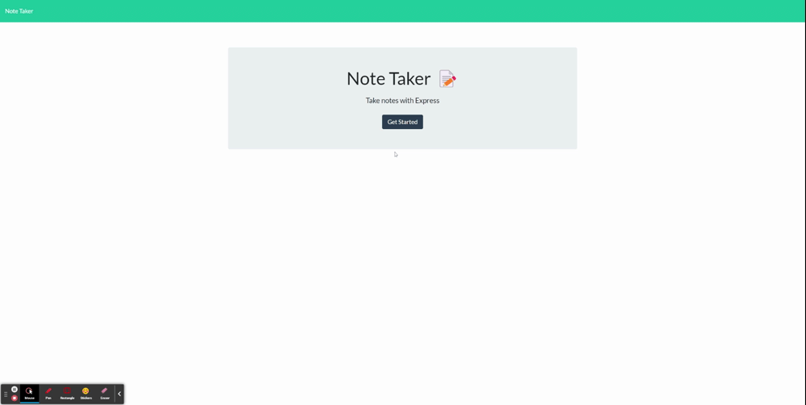

# Note Taker

---

## Table of contents

- [Description](#description)
- [Functionality](#functionality)
- [Deployed Application](#deployed-application)
- [Technologies](#technologies)
- [Installation](#installation)
- [Credits](#credits)

---

## Description

This application was built to understand and reinforce the following skills:

- Node.js
- Express.js
- Routing
- Object destructuring
- Exporting and Importing
- File directory Management
- Heroku Deployment

---

## Functionality

---

## Deployed Application

- [Note Taker Application deployed via Heroku](https://intense-journey-68438.herokuapp.com/)

---

## Technologies

- [JavaScript](https://www.javascript.com/)
- [Bootstrap](https://getbootstrap.com/)
- [Node.js](https://nodejs.org/)
- [Express.js](https://expressjs.com/)
- [uuidv4](https://www.npmjs.com/package/uuidv4)

---

## Installation

1. Clone the repository from Github down to your local machine
2. Open the repository in your preferred source code editor
3. Navigate to your command line interface and enter `npm i` to install all dependencies
4. Once the appropriate packages have installed, initialize the program by entering `node server.js`into your command line interface
5. Once you receive a response that the server is operational, navigate to `http://localhost:3005/` on your preferred web browser to use the application locally

---

## Credits

#### Alex Miramontes - Jr. Web Developer

[Github](https://www.github.com/amiramonte)
